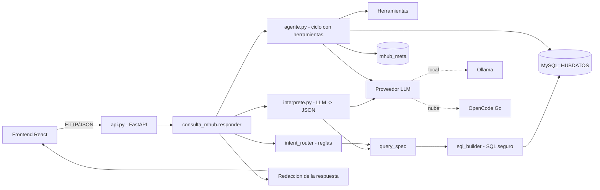
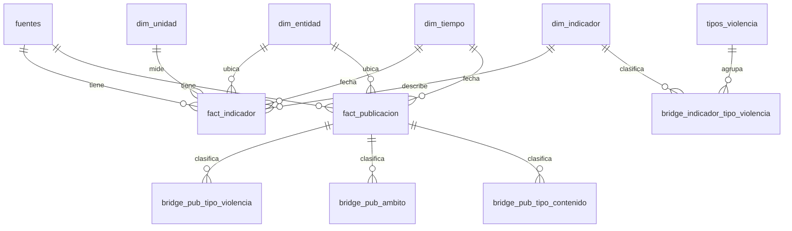
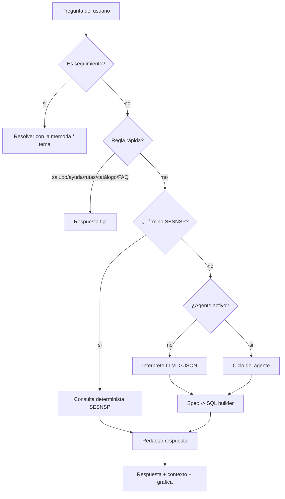
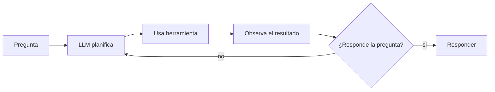

# MHub — Backend

Backend del hub de datos **MHub**: un asistente que responde preguntas en español
sobre **violencia contra las mujeres en México** usando **datos oficiales**
(ENDIREH, SIESVIM, INMUJERES, SESNSP) y **publicaciones de X**, con reglas estrictas
para **no inventar cifras** y **citar siempre la fuente**.

Este documento explica **cómo funciona todo**: cómo está armada la base de datos,
cómo razona el chat y cómo ejecutarlo.

---

## Índice

1. [Qué es y qué resuelve](#1-qué-es-y-qué-resuelve)
2. [Requisitos](#2-requisitos)
3. [Cómo ejecutarlo (paso a paso)](#3-cómo-ejecutarlo-paso-a-paso)
4. [Cómo se conecta con el frontend](#4-cómo-se-conecta-con-el-frontend)
5. [Arquitectura general](#5-arquitectura-general)
6. [La base de datos explicada](#6-la-base-de-datos-explicada)
7. [Cómo funciona el chat (el corazón del sistema)](#7-cómo-funciona-el-chat)
8. [El agente (razonamiento en ciclo)](#8-el-agente-razonamiento-en-ciclo)
9. [Proveedor de LLM: local u OpenCode](#9-proveedor-de-llm-local-u-opencode)
10. [El Panel (dashboard manual)](#10-el-panel-dashboard-manual)
11. [Mapa de archivos](#11-mapa-de-archivos)
12. [Validación y pruebas](#12-validación-y-pruebas)
13. [Glosario](#13-glosario)
14. [Decisiones de diseño](#14-decisiones-de-diseño)

---

## 1. Qué es y qué resuelve

MHub centraliza indicadores de violencia de género dispersos en varias fuentes y
permite **preguntar en lenguaje natural** ("promedio de ENDIREH para Jalisco en
2021"). El backend:

- **Entiende** la pregunta (con un modelo de lenguaje, LLM).
- **Consulta** la base de datos de forma **segura** (solo lectura, SQL controlado).
- **Responde** en español, citando la fuente, sin inventar cifras.

Además expone un **Panel** de consulta **manual** (filtros + gráficas) sin usar chat.

Fuentes integradas:

| Fuente | Tipo | Cobertura | Unidad |
|--------|------|-----------|--------|
| **ENDIREH** (INEGI) | Encuesta de prevalencia | 32 estados, 2006–2021 | porcentaje |
| **SIESVIM** (INEGI) | Sistema de indicadores | 32 estados + país, 2003–2024 | porcentaje |
| **INMUJERES** | Conteos nacionales | nacional, 2003–2024 | conteo |
| **SESNSP** | Incidencia delictiva y llamadas 911 | nacional, 2015–2025 | conteo |
| **X** | Publicaciones de la red social | 18 estados, 2021–2026 | publicaciones |

---

## 2. Requisitos

- **Python 3.10+** (probado con 3.14).
- **MySQL 8** en marcha.
- **Ollama** (para el modo local) con un modelo, p.ej. `qwen2.5:7b`.
- Opcional: una **API key de OpenCode Go** para usar un modelo en la nube (más potente).

Dependencias del backend (`backend/requirements.txt`):

```
fastapi>=0.115
uvicorn[standard]>=0.30
mysql-connector-python>=9.0
requests>=2.32
```

---

## 3. Cómo ejecutarlo (paso a paso)

> Ejecuta los comandos desde la carpeta `HubINEGI/`.

### 3.1 Entorno y dependencias

```bash
cd backend
python -m venv .venv
# Windows:
.venv\Scripts\activate
# Linux/Mac:
# source .venv/bin/activate

pip install -r requirements.txt
```

### 3.2 Configurar el archivo `.env`

Copia `backend/.env.example` a `backend/.env` y ajusta:

```env
# MySQL (obligatorio)
MYSQL_PASSWORD=tu_contraseña
# MYSQL_HOST=localhost
# MYSQL_PORT=3306
# MYSQL_USER=root
# MYSQL_DATABASE=HUBDATOS

# Proveedor del LLM: local (Ollama) u opencode
MHUB_LLM_PROVIDER=local
# MHUB_LLM_FALLBACK=

# Agente: auto | 1 | 0  (auto = activo con opencode, inactivo con local)
# MHUB_AGENTE=auto

# Modelo de Ollama
# OLLAMA_MODEL=qwen2.5:7b

# OpenCode Go (solo si MHUB_LLM_PROVIDER=opencode)
# OPENCODE_API_KEY=tu-api-key
# OPENCODE_GO_MODEL=deepseek-v4.1-flash
# OPENCODE_URL=https://opencode.ai/zen/go/v1/chat/completions
```

> `MYSQL_PASSWORD` es obligatorio. Todo lo demás tiene valores por defecto.

### 3.3 Crear la base de datos

El backend usa **dos bases**: `HUBDATOS` (los datos) y `mhub_meta` (la metadata
semántica). Los scripts `.sql` de `sql/` las crean **en orden**:

```bash
cd ../sql
python run_sql.py 01_entidades.sql     --database HUBDATOS
python run_sql.py 02_star_schema.sql   --database HUBDATOS
python run_sql.py 03_vistas_compat.sql --database HUBDATOS
python run_sql.py 04_mhub_meta.sql     --database mhub_meta --create-database mhub_meta
python run_sql.py 05_corpus_faq.sql    --database HUBDATOS
python run_sql.py 06_conversacion.sql  --database mhub_meta
python run_sql.py 07_tipo_violencia.sql --database HUBDATOS
```

> `run_sql.py` es un pequeño ejecutor que lee un `.sql`, lo separa en sentencias
> y las aplica. Es **idempotente** (se puede correr varias veces).

### 3.4 Cargar los datos (ETL)

```bash
cd ../ingestion/migracion
python etl_star_schema.py            # migra ENDIREH/SIESVIM/INMUJERES/X al esquema en estrella
python migrar_metadata_semantica.py  # pasa el "diccionario" a mhub_meta
python cargar_corpus_faq.py          # carga los documentos para FAQ / rutas
python poblar_tipo_violencia.py      # llena las relaciones indicador↔tipo de violencia
python cargar_sesnsp.py              # series de incidencia delictiva y 911 (SESNSP)
```

### 3.5 Arrancar la API

```bash
cd ../../backend
uvicorn api:app --reload
```

La API queda en `http://localhost:8000`. Comprueba:

```bash
curl http://localhost:8000/salud
curl http://localhost:8000/estado
```

### 3.6 Probar una consulta

```bash
curl -X POST http://localhost:8000/consulta \
  -H "Content-Type: application/json" \
  -d "{\"pregunta\": \"promedio de ENDIREH para Jalisco en 2021\"}"
```

---

## 4. Cómo se conecta con el frontend

- El frontend (React) habla con este backend por **HTTP/JSON**.
- **CORS**: el backend permite los orígenes configurados en `MHUB_CORS_ORIGINS`
  (por defecto `*`, es decir, cualquiera en desarrollo).
- **URL del backend en el front**: variable `VITE_MHUB_API_URL` (por defecto
  `http://localhost:8000`).

Contrato (endpoints que usa el front):

| Método | Ruta | Entrada | Salida |
|--------|------|---------|--------|
| `GET` | `/salud` | — | `{estado:"ok"}` |
| `GET` | `/estado` | — | conteos de filas por tabla |
| `POST` | `/consulta` | `{pregunta, contexto}` | `{respuesta, sql, resultados, contexto, grafica}` |
| `GET` | `/filtros` | — | opciones del Panel por fuente |
| `POST` | `/panel` | `{fuente, entidad, anio, tipo, delito}` | KPIs + bloques + texto |

El **`contexto`** que devuelve `/consulta` es la "memoria" de la conversación: el
front lo guarda y lo reenvía en el siguiente mensaje para que el chat **siga el hilo**.

---

## 5. Arquitectura general



En palabras: el front manda la pregunta → el **orquestador** (`consulta_mhub.py`)
decide el camino → o responde con una **regla fija**, o **razona** (agente/intérprete)
y consulta la base por medio del **constructor de SQL** → se **redacta** la respuesta
y se devuelve.

---

## 6. La base de datos explicada

### 6.1 La idea: un "esquema en estrella"

Imagina un **centro** con los números (los hechos) y **alrededor** varios "catálogos"
que describen *qué* es ese número (dimensiones).

- **Hechos**: una fila = un valor concreto ("Jalisco, 2021, indicador X = 37.58").
- **Dimensiones**: el *qué* (indicador), el *dónde* (entidad), el *cuándo* (año),
  el *de quién* (fuente) y la *unidad* (porcentaje/conteo).

La ventaja: una pregunta como "promedio de ENDIREH por entidad" se resuelve con
**una sola tabla de hechos** cruzada con dimensiones, sin repetir estructuras por
cada fuente. Antes había **tres tablas de indicadores** distintas (ENDIREH, SIESVIM,
INMUJERES) que obligaban a "pegar" consultas; ahora son **una sola**.

### 6.2 Diagrama del esquema



### 6.3 Tablas principales (en `HUBDATOS`)

| Tabla | Qué guarda | Ejemplo |
|-------|------------|---------|
| `fuentes` | Las fuentes de datos | ENDIREH, SIESVIM, INMUJERES, SESNSP, X |
| `dim_entidad` | Entidades canónicas | Jalisco, Puebla, "Estados Unidos Mexicanos" |
| `dim_entidad_alias` | Sinónimos de entidades | "Coahuila de Zaragoza" → Coahuila |
| `dim_tiempo` | Años por tipo | (`2021`, tipo `dato` / `publicacion` / `mencion`) |
| `dim_unidad` | Unidades de medida | porcentaje, conteo |
| `dim_indicador` | El catálogo de indicadores | "Víctimas mujeres de feminicidio" |
| `dim_indicador_alias` | Sinónimos de indicadores | — |
| `fact_indicador` | **Los valores numéricos** | Jalisco, 2021, indicador X, 37.58, porcentaje |
| `fact_publicacion` | Publicaciones de X | texto, usuario, entidad, año |
| `tipos_violencia`, `ambitos_violencia`, `tipos_contenido` | Catálogos | física, psicológica, pareja… |
| `bridge_indicador_tipo_violencia` | Indicador ↔ tipo de violencia | (indicador, "sexual") |
| `bridge_pub_tipo_violencia`, `bridge_pub_ambito`, `bridge_pub_tipo_contenido` | Publicación ↔ catálogos | — |

### 6.4 `mhub_meta`: la metadata semántica

Segunda base que **describe** la primera para que el LLM la entienda. En vez de
tener el "diccionario" como texto en el código, vive en tablas:

| Tabla | Contiene |
|-------|----------|
| `sem_tabla`, `sem_columna` | Descripción de cada tabla y columna del esquema |
| `sem_metrica` | Operaciones ("promedio" → `AVG`, "máximo" → `MAX`, …) |
| `sem_sinonimo` | Sinónimos de fuentes, términos, etc. |
| `sem_ejemplo` | Ejemplos pregunta→SQL para el prompt |
| `sem_regla` | Reglas (grupos `sql`, `respuesta`, `explicacion`) |
| `glosario` | Definiciones (prevalencia, incidencia, subregistro, CJM…) |
| `faq` | Preguntas frecuentes con respuesta fija |
| `cat_intencion` | Catálogo de tipos de intención (FAQ, consulta, rutas…) |

**Ventaja:** agregar un sinónimo o una FAQ es un `INSERT`, sin tocar código.

### 6.5 Vistas de compatibilidad

`v_indicadores_endireh`, `v_indicadores_siesvim`, `v_indicadores_inmujeres` recrean
las **tablas antiguas** a partir del esquema en estrella. Sirven para que el código
viejo (el generador de SQL libre) siga funcionando sin cambios.

### 6.6 Cómo se cargó (ETL)

`ingestion/migracion/`:

- `etl_star_schema.py` — lee las tablas originales y llena dimensiones y hechos.
- `migrar_metadata_semantica.py` — pasa los `.py` (diccionario/reglas/ejemplos) a `mhub_meta`.
- `cargar_corpus_faq.py` — carga los documentos (PDFs → fragmentos) para FAQ/rutas.
- `poblar_tipo_violencia.py` — cruza indicadores y publicaciones con tipos de violencia.
- `cargar_sesnsp.py` — extrae las **series anuales** del informe 911 (SESNSP).

---

## 7. Cómo funciona el chat

### 7.1 Visión general del mensaje



### 7.2 Paso 1 — Reglas rápidas (fast-path)

En `intent_router.py` hay reglas para casos **frecuentes y de alta precisión**, que
no necesitan razonar:

- **Saludo / ayuda / fuera de tema** → respuesta fija.
- **Rutas de atención** ("¿a dónde puedo acudir?") → respuesta curada (911, CJM…).
- **Catálogos** ("¿cuántos tipos de violencia existen?") → `catalogo.py`.
- **FAQ** ("¿qué es prevalencia?") → `faq_store.py`.
- **SESNSP** (feminicidio, homicidio, 911…) → `terminos_sesnsp.py` (mapeo fijo).

Estas reglas son la **primera puerta**, no la única. Si no coinciden, se **razona**.

### 7.3 Paso 2 — El intérprete (LLM → JSON)

`interprete.py` le pide al LLM que convierta la pregunta en un **JSON** con la
intención y los "slots":

```json
{
  "intencion": "consulta",
  "operacion": "promedio",
  "fuente": "ENDIREH",
  "entidad": "Jalisco",
  "anio": 2021,
  "tipo_violencia": null
}
```

- Se apoya en **few-shot** (ejemplos dentro del prompt) y en `sem_*`.
- Un **vocabulario difuso** (`vocabulario.py`, con coincidencia tolerante a errores)
  le da una "pista" por si el usuario escribe mal ("tpos de violncia").
- El resultado **se valida** contra la base: si el LLM inventa una entidad o un año,
  se descarta.

### 7.4 Paso 3 — La "spec" y el constructor de SQL

La intención se convierte en una **spec** (`query_spec.py`): una descripción
estructurada de la consulta. Luego `sql_builder.py` arma el **SQL de forma
determinista** (no lo escribe el LLM):

- Solo `SELECT`, solo tablas permitidas.
- Filtros por **parámetros** (`%s`), nunca concatenación → **sin inyección**.
- Maneja las operaciones: `detalle`, `conteo`, `promedio`, `maximo`, `minimo`,
  `por_anio`, `por_entidad`, `por_tipo_violencia`, `comparar`, `anios_disponibles`.

> Esta es la clave de la **seguridad y la honestidad**: el LLM *elige*, pero el SQL
> lo construye el backend; y **todo número sale de la base**, nunca del modelo.

### 7.5 Paso 4 — Redacción de la respuesta

Con las filas recuperadas, `consulta_mhub.generar_respuesta()` le pide al LLM una
respuesta breve en español, bajo reglas anti-invención (`reglas_respuesta.py`):
cita la fuente, no inventa, distingue mediciones, no emite juicios de valor.
Puede usar **Markdown** (negritas, listas, tablas).

### 7.6 Memoria de conversación

El `contexto` guarda:

- `historial` — los últimos turnos (pregunta/respuesta).
- `tema` — el **estado actual**: entidad, fuente, año, indicador, tipo, operación.

Con eso se resuelven los **seguimientos** (`_resolver_anafora`):
"¿y en 2021?", "¿de dónde sale ese dato?", "¿qué dicen los otros años?",
"¿cuáles son?", "¿de qué son esas publicaciones?".

### 7.7 Ejemplo paso a paso

Pregunta: **"promedio de ENDIREH para Jalisco en 2021"**

1. `responder()` (en `consulta_mhub.py`) recibe la pregunta.
2. No es seguimiento; no es saludo/FAQ/rutas/SESNSP.
3. Se activa el **agente** (o el intérprete si el agente está apagado).
4. El LLM decide: `{accion:"consultar", operacion:"promedio", fuente:"ENDIREH",
   entidad:"Jalisco", anio:2021}`.
5. `query_spec` + `sql_builder` construyen:
   `SELECT AVG(f.valor) ... WHERE fuente='ENDIREH' AND entidad='Jalisco' AND anio=2021`.
6. Se ejecuta en MySQL → `37.58`.
7. Se redacta: *"El promedio de ENDIREH para Jalisco en 2021 fue 37.58%…"* citando la fuente.
8. Se devuelve `{respuesta, sql, resultados, contexto, grafica}`.

---

## 8. El agente (razonamiento en ciclo)

Cuando está activo (`agente.py`), en vez de "un solo disparo", el sistema **razona
en un ciclo**:



**Herramientas** disponibles:

| Herramienta | Para qué |
|-------------|----------|
| `consultar` | Traer datos (SQL seguro vía `sql_builder`) |
| `catalogo` | Tipos de violencia, fuentes, entidades… |
| `cobertura` | Qué años hay para un filtro |
| `definicion` | Glosario / FAQ / corpus |

Ventaja: si la primera consulta no responde (p.ej. sale vacía), el agente **lo nota
y vuelve a intentar** con otro enfoque. Límite: 3 intentos.

> Con el modelo **local** (`qwen2.5:7b`) el agente queda *desactivado* por defecto y
> se usa el intérprete + reglas (más estable). Con **OpenCode** se activa solo.

---

## 9. Proveedor de LLM: local u OpenCode

Todo pasa por `ollama_service.py`, que decide el proveedor según `.env`:

- **`local`** (por defecto): usa **Ollama** (`http://localhost:11434`). Offline, gratis, privado.
- **`opencode`**: usa la **API de OpenCode Go** (compatible con OpenAI), con
  `OPENCODE_API_KEY` y `OPENCODE_GO_MODEL`. Más potente, pero requiere internet.

Variables:

| Variable | Efecto |
|----------|--------|
| `MHUB_LLM_PROVIDER` | `local` u `opencode` |
| `MHUB_LLM_FALLBACK` | Respaldo si el proveedor falla |
| `MHUB_AGENTE` | `auto` (activo con opencode), `1` (siempre), `0` (nunca) |
| `OLLAMA_MODEL` | Modelo local (p.ej. `qwen2.5:7b`) |
| `OPENCODE_API_KEY`, `OPENCODE_GO_MODEL` | Credenciales y modelo en la nube |

Si están en **local**, **no se envía nada a la nube** (privacidad).

---

## 10. El Panel (dashboard manual)

Sin chat: el usuario **elige filtros** y ve gráficas y KPIs. Lo sirve `panel.py`.

- `GET /filtros` → qué opciones aplican a cada fuente (años, entidades, tipos, temas).
- `POST /panel` → recibe `{fuente, entidad, anio, tipo, delito}` y devuelve:
  - **KPIs** (año más alto, promedio, entidad más alta/baja…),
  - **bloques** de gráfica (`linea`, `barra_horizontal`, `dona`),
  - un **texto** que resume la lectura de los datos.

Los bloques se recalculan con `sql_builder` y `graficas.construir_grafica()`. Si un
filtro no aplica (p.ej. "entidad" en una fuente nacional como INMUJERES/SESNSP), el
front lo deshabilita.

---

## 11. Mapa de archivos

| Archivo | Responsabilidad |
|---------|-----------------|
| `api.py` | App FastAPI y endpoints (`/consulta`, `/filtros`, `/panel`…) |
| `database.py` | Conexión a MySQL y `ejecutar_select()` |
| `env_config.py` | Carga las variables de `backend/.env` |
| `ollama_service.py` | Proveedor de LLM (Ollama / OpenCode) |
| `consulta_mhub.py` | **Orquestador**: decide el flujo y redacta |
| `intent_router.py` | Enrutador por reglas (fast-path) |
| `vocabulario.py` | Pista difusa (tolerante a errores de escritura) |
| `interprete.py` | LLM → JSON (intención + slots) |
| `semantic_loader.py` | Carga `mhub_meta` y resuelve entidades/indicadores/métricas |
| `catalogo.py` | Catálogos (tipos de violencia, fuentes, entidades…) |
| `faq_store.py` | FAQ, glosario y búsqueda en el corpus (FULLTEXT) |
| `terminos_sesnsp.py` | Términos SESNSP → indicador (feminicidio, 911…) |
| `query_spec.py` | Construye y valida la "spec" de consulta |
| `sql_builder.py` | Convierte la spec en **SQL seguro** |
| `agente.py` | Agente con herramientas y ciclo de razonamiento |
| `graficas.py` | Especificación de gráficas |
| `panel.py` | Construye el dashboard manual |
| `contexto_conversacional.py` | Utilidades de seguimiento (contexto) |
| `reglas_sql.py`, `reglas_respuesta.py`, `diccionario_semantico.py`, `examples_nl_sql.py`, `esquema_db.py` | Constantes que se migraron a `mhub_meta` y sirven de respaldo |
| `sql_generator.py` | Generador **NL→SQL libre** (respaldo heredado) |

Y fuera del backend:

| Carpeta | Contiene |
|---------|----------|
| `sql/` | Los `.sql` de creación + `run_sql.py` |
| `ingestion/migracion/` | Los ETL (carga y migración de datos) |
| `ingestion/limpieza_*.py`, `ingestion/cargar_*_mysql.py` | Limpieza y carga original de cada fuente |
| `tests/` | Golden sets y runners de validación |

---

## 12. Validación y pruebas

Se valida con **golden sets** (conjuntos de casos con resultado esperado):

| Runner | Qué valida | Resultado |
|--------|-----------|-----------|
| `tests/run_golden.py` | Intención, operación y SQL (sin LLM) | 31/31 |
| `tests/run_conversacion.py` | Seguimientos y anáforas (sin LLM) | 11/11 |
| `tests/run_interprete.py` | Que el LLM extraiga bien los slots (requiere LLM) | 14/14 |

```bash
cd tests
python run_golden.py
python run_conversacion.py
# python run_interprete.py   # requiere Ollama/OpenCode en marcha
```

**Qué prueban:** rutas, detalle, cada operación de agregación, seguimiento,
preguntas frecuentes, catálogos, rutas de atención, SECNSP y comparaciones.

---

## 13. Glosario

- **LLM**: modelo de lenguaje grande (el "cerebro" que entiende y redacta).
- **NL / lenguaje natural**: cómo escribe una persona ("promedio de…"), no código.
- **Esquema en estrella**: hechos al centro, dimensiones alrededor (ver §6).
- **Hechos / dimensiones**: los números / lo que los describe (qué, dónde, cuándo).
- **ETL**: proceso de extraer, limpiar y cargar datos.
- **Spec**: descripción estructurada de la consulta antes de convertirla en SQL.
- **Prompt**: instrucciones que se le dan al LLM.
- **Few-shot**: incluir ejemplos en el prompt para guiar al modelo.
- **Agente**: un bucle donde el modelo usa herramientas y evalúa resultados.
- **FULLTEXT**: búsqueda de texto de MySQL (por palabras).
- **SQL determinista**: SQL construido por código, no por el modelo (seguro).

---

## 14. Decisiones de diseño

- **No se usa RAG vectorial.** Los datos son tabulares y numéricos; para responder
  "el valor más alto" o "el promedio" se necesita **SQL con agregaciones**, no
  similitud semántica.
- **El LLM no escribe SQL.** Solo elige la intención y los parámetros; el
  `sql_builder` construye el SQL. Así se evita inventar datos y la inyección.
- **Anti-invención**: toda cifra sale de la base o del corpus; siempre se cita la fuente.
- **Local por defecto**: el sistema funciona offline y sin enviar datos a la nube.
- **Dos bases**: separar datos (`HUBDATOS`) de metadata (`mhub_meta`) permite
  evolucionar el "diccionario" con `INSERT`, sin tocar el código.
- **SESNSP y los PDFs son texto**: primero entraron como **corpus** (para FAQ y
  rutas); de ahí se **extrajeron series** al esquema cuando era posible.

---

> El README del **frontend** (cómo se ejecuta y cómo usa estos endpoints) se
> encuentra en su propio repositorio.
